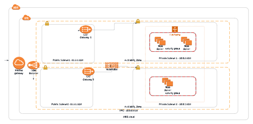

# Udacity Project (IAC) wth Cloud Formation





### Create Network and Servers
``` 
./create.sh udagram infra_yaml/network.yaml  infra_yaml/network_parameters.json
```
``` 
/create.sh udagram_appservers  infra_yaml/servers.yaml  infra_yaml/servers_parameters.json  
```

### update Network and Servers
``` 
./update.sh udagram infra_yaml/network.yaml  infra_yaml/network_parameters.json
```
``` 
./update.sh udagram_appservers  infra_yaml/servers.yaml  infra_yaml/servers_parameters.json  
```

### delete Network and Servers
``` 
./delete.sh udagram
```
``` 
./delete.sh udagram_appservers 
```
## More features to add
### Bastion Host
### S3 Bucket


